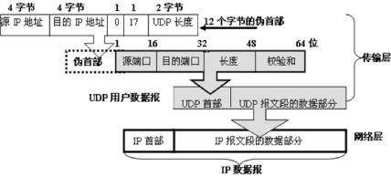

[toc]

# UDP服务

## 概述

用户数据报协议 UDP(User Datagram Protocol)：是无连接的，而且“不可靠”。

## 数据结构

UDP 分组称为用户数据报，有 8 字节的固定首部，这个首部由 4 个字段组成，每个字段 2 字节（16 位）。

## 服务

（1）UDP 使用套接字地址提供进程到进程的通信。
（2）无连接服务：应用进程的每次输出操作均生成一个UDP数据包，数据报独立，没有编号，不排序，数据报可以沿不同路径传递。
（3）没有流量控制，没有窗口机制，当到来的报文太多时，接收方可能会溢出。
（4）除了校验和外，UDP 没有差错控制机制，发送方不知道报文丢失还是重传。
（5）不提供拥塞控制，UDP 假设被发送的分组很小且零星，不会在网络中造成拥塞。
（6）封装和解封装。
（7）多路复用与多路分解。